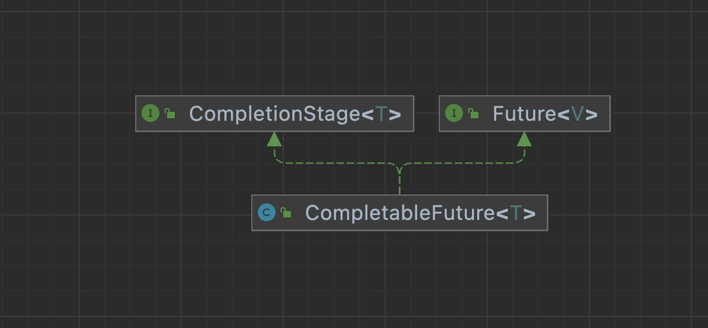

# CompletableFuture入门
## 学习内容

- 为什么选择CompletableFuture
- 创建CompletableFuture异步任务
- CompletableFuture异步任务回调
- CompletableFuture异步任务编排
- CompletableFuture的异常处理

## 学习目标

- 了解 CompletableFuture 的优点
- 掌握创建异步任务
    * 创建异步任务的2种方式
    * 知道异步任务中线程池的作用
    * 理解异步任务编程思想
- 掌握异步任务回调
    * thenApply / thenAccept / thenRun 3类方法使用和区别
    * 解锁一系列Async版本回调 (thenXxxAsync)
- 掌握异步任务的异常处理
    * 会对异步任务进行异常处理
    * 会对回调链上对单个异步任务的异常进行现场恢复

## 课程学习说明

- 熟悉多线程理论知识
- 接触过 Future 和 线程池 的经历
- 会使用Lambda表达式和 Stream-API

### 1、Future vs CompletableFuture

#### 1.1 准备工作

为了便于后续更好地调试和学习，我们需要定义一个工具类辅助我们对知识的理解

```java
import java.nio.file.Files;
import java.nio.file.Paths;
import java.util.StringJoiner;
import java.util.concurrent.TimeUnit;

/**
 * 异步任务辅助工具类
 */
public class CommonUtils {
  // 读取文件路径的文件
  public static String readFile(String pathToFile) {
    try {
      return Files.readString(Paths.get(pathToFile));
    } catch (IOException e) {
      e.printStackTrace();
      return "";
    }
  }

  // 休眠指定的毫秒数
  public static void sleepMillis(long millis) {
    try {
      TimeUnit.MILLISECONDS.sleep(millis);
    } catch (InterruptedException e) {
      e.printStackTrace();
    }
  }

  // 休眠指定的秒数
  public static void sleepSecond(long second) {
    try {
      TimeUnit.SECONDS.sleep(second);
    } catch (InterruptedException e) {
      e.printStackTrace();
    }
  }
  // 打印输出带线程信息的日志
  public static void printTheadLog(String message) {
    // 时间戳 | 线程id | 线程名 | 日志信息
    String result = new StringJoiner(" | ")
            .add(String.valueOf(System.currentTimeMillis()))
            .add(String.format("%2d", Thread.currentThread().getId()))
            .add(Thread.currentThread().getName())
            .add(message)
            .toString();
    System.out.println(result);
  }

}
```

#### 1.2 Future 的局限性

需求： 替换新闻稿（news.txt)中的敏感词汇，把敏感词汇替换成*，敏感词存储在 filter_words.txt 中
```java
public class FutureDemo {
    public static void main(String[] args) throws ExecutionException, InterruptedException {

        ExecutorService executor = Executors.newFixedThreadPool(5);
        // step 1: 读取敏感词汇 => thread1
        Future<String[]> filterWordFuture = executor.submit(() -> {
            String str = CommonUtils.readFile("filter_words.txt");
            String[] filterWords = str.split(",");
            return filterWords;
        });

        // step 2: 读取新闻稿 => thread2
        Future<String> newsFuture = executor.submit(() -> {
            return CommonUtils.readFile("news.txt");
        });

        // step 3: 替换操作 => thread3
        Future<String> replaceFuture = executor.submit(() -> {
            String[] words = filterWordFuture.get();
            String news = newsFuture.get();
            for (String word : words) {
                if (news.indexOf(word) > 0) {
                    news = news.replace(word, "**");
                }
            }
            return news;
        });
        // step 4: 打印输出替换后的新闻稿 => main
        String filteredNews = replaceFuture.get();
        System.out.println("filteredNews = " + filteredNews);

        executor.shutdown();
    }
}
```
通过上面的代码，我们会发现， Future相比于所有任务都直接在主线程处理，有很多优势，但同时也存在不足，至少表现如下：

* **在没有阻塞的情况下，无法对Future的结果执行进一步的操作。** Future不会告知你它什么时候完成，你如果想要得到结果，必须通过一个get()方法，该方法会阻塞直到结果可用为止。它不具备将回调函数附加到Future后并在Future的结果可用时自动调用回调的能力。
* **无法解决任务相互依赖的问题。** filterWordFuture和newsFuture的结果不能自动发送给replaceFuture, 需要在replaceFuture中手动获取，所以使用Future不能轻而易举地创建异步工作流。
* **不能将多个Future合并在一起。** 假设你有多种不同的Future, 你想在它们全部并行完成后然后运行某个函数，Future很难独立完成这一需要。
* **没有异常处理。** Future提供的方法中没有专门的API应对异常处理，还需要开发者自己手动异常处理。

#### 1.3 CompletableFuture 的优势



**CompletableFuture**实现了**Future**和**CompletionStage**接口

CompletableFuture相对于Future具有以下优势：
* 为快速创建、链接依赖和结合多个Future提供了大量的便利方法。
* 提供了适用于各种开发场景的回调函数。它还提供了非常全面的异常处理支持。
* 无疑衔接和亲和lambda表达式和Stream - API。
* 我见过的真正意义上的异步编程，把异步编程和函数式编程、响应式编程多种高阶编程思维集于一身，设计上更优雅。

### 2、创建异步任务

#### 2.1 runAsync

如果你要异步运行某些耗时的后台任务，并且不想从任务中返回任何内容，则可以使用`CompletableFuture.runAsync()`方法。它接受一个Runnable接口实现类对象，方法返回`CompletableFuture<Void>`对象

```
static CompletableFuture<Void> runAsync(Runnable runnable)
```
演示案例：创建一个不从任务中返回任何内容的CompletableFuture异步任务对象
```java

public class RunAsyncDemo {
  public static void main(String[] args) {
    // runAsync 创建异步任务
    CommonUtils.printTheadLog("main start");
    // 使用Runnable匿名内部类
    CompletableFuture.runAsync(new Runnable() {
      @Override
      public void run() {
        CommonUtils.printTheadLog("读取文件开始");
        // 使用睡眠来模拟一个长时间的工作任务（例如读取文件，网络请求等）
        CommonUtils.sleepSecond(3);
        CommonUtils.printTheadLog("读取文件结束");
      }
    });

    CommonUtils.printTheadLog("here are not blacked,main continue");
    CommonUtils.sleepSecond(4); // 此处休眠 为的是等待CompletableFuture背后的线程池执行完成。
    CommonUtils.printTheadLog("main end");
  }
}
```

我们也可以以Lambda表达式的形式传递Runnable接口实现类对象

```java
public class RunAsyncDemo2 {
    public static void main(String[] args) {
        // runAsync 创建异步任务
        CommonUtils.printTheadLog("main start");
        // 使用Lambda表达式
        CompletableFuture.runAsync(new Runnable() {
            @Override
            public void run() {
                CommonUtils.printTheadLog("读取文件开始");
                // 使用睡眠来模拟一个长时间的工作任务（例如读取文件，网络请求等）
                CommonUtils.sleepSecond(3);
                CommonUtils.printTheadLog("读取文件结束");
            }
        });

        CommonUtils.printTheadLog("here are not blacked,main continue");
        CommonUtils.sleepSecond(4); // 此处休眠 为的是等待CompletableFuture背后的线程池执行完成。
        CommonUtils.printTheadLog("main end");
    }
}

```

需求：使用CompletableFuture开启异步任务读取news.txt文件中的新闻稿，并打印输出。

```java

public class RunAsyncDemo3 {
    public static void main(String[] args) {
        // 需求：使用CompletableFuture开启异步任务读取news.txt文件中的新闻稿，并打印输出。
        CommonUtils.printTheadLog("main start");

        CompletableFuture.runAsync(() -> {
            CommonUtils.printTheadLog("读取文件");
            String content = CommonUtils.readFile("news.txt");
            System.out.println(content);
        });

        CommonUtils.printTheadLog("here not blacked main continue");
        CommonUtils.sleepSecond(4);
        CommonUtils.printTheadLog("main end");
    }
}

```

 **疑问**： 异步任务是并发执行还是并行执行？ 
 
* 如果是单核CPU，那么异步任务之间就是并发执行，如果是多核CPU（多CPU）异步任务就是并行执行
* **重点**： 作为开发者，我们只需要清楚如何开启异步任务，CPU硬件会把异步任务合理的分配给CPU上的核运行。

#### 2.2 supplyAsync
`Completable?Future.runAsync()`开启不带返回结果异步任务。但是，如果你想从后台的异步任务中返回一个结果怎么办？此时，`CompletalbeFuture.supplyAsync()`是你的最好的选择了。

```
static <U> CompletableFuture<U> supplyAsync(Supplier<U> supplier)
```
它入参一个`Supplier<U>`供给者，用于供给带返回值的异步任务

并返回`CompletableFuture<U>`,其中的U是供给者给值的类型。

需求： 开启异步任务读取news.txt文件中的新闻稿，返回文件中内容并在主线程打印输出

```java
public class SupplyAsyncDemo {
    public static void main(String[] args) throws ExecutionException, InterruptedException {
        // 需求： 开启异步任务读取news.txt文件中的新闻稿，返回文件中内容并在主线程打印输出
        CommonUtils.printTheadLog("main start");

        CompletableFuture<String> newsFuture = CompletableFuture.supplyAsync(new Supplier<String>() {
            @Override
            public String get() {
                String content = CommonUtils.readFile("news.txt");
                return content;
            }
        });

        CommonUtils.printTheadLog("here not blacked,main continue");
        // 阻塞并等待newsFuture完成
        String news = newsFuture.get();
        System.out.println("news = " + news);
        CommonUtils.printTheadLog("main end");
    }
}

```

如果想要获取newsFuture结果，可以调用completableFuture.get()方法，get()将阻塞，直到newsFuture完成。

**疑问：** get方法阻塞的，会不会影响程序性能？

后面会讲解回调函数

我们依然可以使用Java 8的Lambda表达式使上面的代码更简洁。

```java
CompletableFuture<String> newsFuture = CompletableFuture.supplyAsync(() -> {
    String news = CommonUtils.readFile("news.txt");
    return news;
});
```
#### 2.3 异步任务中的线程池

大家已经知道，`runAsync()`和`supplyAsync()`方法都是开启单独的线程中执行异步任务。但是，我们从未创建线程对吗？不是吗？

CompletableFuture会从全局`ForkJoinPool.commonPool()`线程池获取来执行这些任务

当然， 你也可以创建一个线程池，并将其传递给`runAsync()`
和`supplyAsync()`方法，以使它们在从您指定的线程池获得的线程中执行任务。

CompletableFuture API中的所有方法都有两种变体，一种是接受传入的`Executor`参数作为指定的线程池，而另一个则使用默认的线程池（`ForkJoinPool.commonPool()`）

```java
// runAsync()重载
static CompletableFuture<Void> runAsync(Runnable runnable)
static CompletableFuture<Void> runAsync(Runnable runnable,
        Executor executor)
// spplyAsync()重载
static <U> CompletableFuture<U> supplyAsync(Supplier<U> supplier)
static <U> CompletableFuture<U> supplyAsync(Supplier<U> supplier,Executor executor)
```
需求：指定线程池，开启异步任务读取news.txt中的新闻稿，返回文件内容并在主线程打印输出

```java
ExecutorService executor = Executors.newFixedThreadPool(4);
CompletableFuture<String> newsFuture = CompletableFuture.supplyAsync(() -> {
    CommonUtils.printTheadLog("异步读取文件开始");
    String news = CommonUtils.readFile("news.txt");
    return news;
},executor);
```
> 最佳实践：创建属于自己的业务线程池
> 
> 如果所有`completableFuture`共享一个线程池，那么一旦有异步任务执行一些很慢的I/O操作，就会导致线程池中所有的线程都阻塞在I/O操作上，从而造成线程饥饿，进而影响整个系统的性能。
> 
> 所以，强烈建议你要根据不同的业务类型创建不同的线程池，以避免互相干扰。

#### 2.4 异步编程思想

综合上述，看到了吧，我们没有显示地创建线程，更没有涉及线程通信的概念，整个过程根本就没涉及线程知识吧，以上专业的说法是：**线程的创建和线程负责的任务进行解耦，它给我们带来的好处线程的创建和启动全部交给线程池负责，具体任务的编写交给程序员，专人专事。**

**异步编程**是可以让程序并行（也可能是并发）运行的一种手段，其可以让程序中的一个工作单元作为异步任务与主线程分开独立运行，并且在异步任务运行结束后，会通知主线程它的运行结果或者失败原因，毫无疑问，一个异步任务其实就是开启一个线程来完成的，使用异步编程可以提高应用程序的性能和响应能力等。

作为开发者，只需要有一个意识：

开发者只需要把耗时的操作交给CompletableFuture开一个异步任务，然后继续关注主线程业务，当异步任务运行完成时会通知主线程它的运行结果。我们把具备了这种编程思想的开发称为**异步编程思想**。

### 3、异步任务回调

`CompletalbeFuture.get()`方法是阻塞的。调用时它会阻塞等待，直到这个Future完成，并在完成后返回结果。但是，很多时候这不是我们想要的。

对于构建异步系统，我们应该能够将**回调**附加到CompletableFuture上，当这个Future完成时，该回调自动被调用，这样，我们就不必等待结果了，然后在Future的回调函数内编写完成Future之后需要执行的逻辑。您可以使用`thenApply()`,`thenAccept()`和`thenRun()`方法，它们可以把回调函数附加到CompletableFuture

#### 3.1 thenApply

使用`thenApply()`方法可以处理和转换CompletableFuture的结果，它以Function<T, U>作为参数。 Function<T, U>是一个函数式接口，表示一个转换操作，它接受类型T的参数并产生类型R的结果

```
CompletableFuture<U> thenApply(Function<? super T,? extends U> fn)
```
需求：异步读取filter_words.txt文件中的内容，读取完成后，把内容转换成数组（敏感词数组），异步任务返回敏感词数组

```java
public class ThenApplyDemo {
    public static void main(String[] args) throws ExecutionException, InterruptedException {
        // 需求：异步读取filter_words.txt文件中的内容，读取完成后，把内容转换成数组（敏感词数组），异步任务返回敏感词数组
        CommonUtils.printTheadLog("main start");

        CompletableFuture<String> readFileFuture = CompletableFuture.supplyAsync(() -> {
            CommonUtils.printTheadLog("读取filter_words文件");
            String filterWordContent = CommonUtils.readFile("filter_words.txt");
            return filterWordContent;

        });
        CompletableFuture<String[]> filterWordsFuture = readFileFuture.thenApply(content -> {
            CommonUtils.printTheadLog("把雇佣兵内容转换成敏感词数组");
            String[] filterWords = content.split(",");
            return filterWords;
        });

        CommonUtils.printTheadLog("main continue");
        String[] filterWords = filterWordsFuture.get();
        System.out.println("Arrays.toString(filterWords) = " + Arrays.toString(filterWords));
        CommonUtils.printTheadLog("main end");
    }
}

```
你还可以通过附加一系列`thenApply()`回调方法，在CompletableFuture上编写一系列转换序列。一个`thenApply()`方法的结果可以传递给序列中的下一个，如果你对链式操作很了解，你会发现结果可以在链式操作上传递。

```java
CompletableFuture<String[]> filterWordsFuture = CompletableFuture.supplyAsync(() -> {
    String filterWordContent = CommonUtils.readFile("filter_words.txt");
    return filterWordContent;
}).thenApply(content -> {
    String[] filterWords = content.split(",");
    return filterWords;
});
```
#### 3.2 thenAccept

如果不想从回调函数返回结果，而只想在Future完成后运行一些代码，则可以使用`thenAccpet()`

这些方法是一个`Consumer<? super T>`，它可以对异步任务的执行结果进行消费使用，方法返回CompletableFuture<Void>

```
CompletableFuture<Void> thenAccept(Consumer<? super T> action)
```

通常用作回调链中的最后一个回调。

需求：异步读取filter_words.txt文件中的内容，读取完成后，把内容转换成敏感词数组，然后打印敏感词数组

```java
public class ThenAcceptDemo {
    public static void main(String[] args) {
        // 需求：异步读取filter_words.txt文件中的内容，读取完成后，把内容转换成敏感词数组，然后打印敏感词数组
        CommonUtils.printTheadLog("main start");

        CompletableFuture.supplyAsync(()->{
            CommonUtils.printTheadLog("读取filter_words.txt文件");
            String filterWordsContent = CommonUtils.readFile("filter_words.txt");
            return filterWordsContent;
        }).thenApply(content ->{
            CommonUtils.printTheadLog("把文件内容转换成敏感词数组");
            String[] filterWords = content.split(",");
            return filterWords;
        }).thenAccept(filterWords->{
            CommonUtils.printTheadLog("filterWorlds = " + Arrays.toString(filterWords));
        });

        CommonUtils.printTheadLog("main continue");
        CommonUtils.sleepSecond(4);
        CommonUtils.printTheadLog("main end");
    }
}
```
#### 3.3 thenRun

前面我们已经知道，通过`thenApply(Function<T,R>)`对链式操作中的上一个异步任务的结果进行转换，返回一个新的结果;
通过`thenAccpet(Consumer<T>)`对链式操作中的上一个异步任务的结果进行消费，不返回新结果;

如果我们只是想从CompletableFuture的链式操作得到一个完成的通知，甚至都不使用上一个链式操作的结果，那么`CompletableFuture.thenRun()`会是你最佳的选择，它需要一个Runnable并返回`CompletableFuture<Void>`

```
CompletableFuture<Void> thenRun(Runnable action);
```

演示案例： 我们仅仅想知道 filter_words.txt 的文件是否读取完成

```java
public class ThenRunDemo {
    public static void main(String[] args) {
        // 演示案例： 我们仅仅想知道敏感词汇的文件是否读取完成
        CommonUtils.printTheadLog("main start");

        CompletableFuture.supplyAsync(() -> {
            CommonUtils.printTheadLog("读取filter_words文件");
            String filterWordsContent = CommonUtils.readFile("filter_words.txt");
            return filterWordsContent;
        }).thenRun(() -> {
            CommonUtils.printTheadLog("读取filter_words文件读取完成");
        });

        CommonUtils.printTheadLog("main continue");
        CommonUtils.sleepSecond(4);
        CommonUtils.printTheadLog("main end");
    }
}
```
#### 3.4 更进一步提供并行化

CompletableFuture 提供的所有回调方法都有两个异步变体

```java
CompletableFuture<U> thenApply(Function<? super T,? extends U> fn) 
// 回调方的异步变体（异步回调）
CompletableFuture<U> thenApplyAsync(Function<? super T,? extends U> fn)
CompletableFuture<U> thenApplyAsync(Function<? super T,? extends U> fn, Executor executor) 
```

注意：这些带了Async的异步回调**通过在单独的线程中执行回调任务**来帮助您进一步促进并行计算。

回顾需求： 异步读取filter_words.txt文件中的内容，读取完成后，转换成敏感词数组，主线程获取结果打印输出这个数组

```java
public class ThenApplyAsyncDemo {
    public static void main(String[] args) throws ExecutionException, InterruptedException {
        //回顾： 异步读取filter_words.txt文件中的内容，读取完成后，转换成敏感词数组，主线程获取结果打印输出这个数组
        CommonUtils.printTheadLog("main start");
        CompletableFuture<String[]> filterWordFuture = CompletableFuture.supplyAsync(() -> {
            /*
            CommonUtils.printTheadLog("读取filter_words.txt文件");
            String filterWordsContent = CommonUtils.readFile("filter_words.txt");
            return filterWordsContent;
            */
            return "尼玛,NB,tmd";
        }).thenApply(content -> {
            CommonUtils.printTheadLog("把文件内容转换成敏感词数组");
            String[] filterWords = content.split(",");
            return filterWords;
        });
        CommonUtils.printTheadLog("main continue");
        String[] filterWords = filterWordFuture.get();
        CommonUtils.printTheadLog("filterWords = " + Arrays.toString(filterWords));
        CommonUtils.printTheadLog("main end");

        /**
         * 总结
         * 一般而言，commonPool为了提高性能，并不会立马收回线程
         * thenApply中回调任务和supplyAsync中的异步任务使用的是同一个线程
         * 特殊情况
         * 如果supplyAsync中的任务是立即返回结果（不是耗时的任务），那么thenApply回调任务也会在主线程执行
         */
    }
}

```
要更好地控制执行回调任务的线程，可以使用异步回调。如果使用`thenApplyAsync()`回调，那么它将在从`ForkJoinPool.commonPool()`获取另一个线程执行
```java
public class ThenApplyAsyncDemo2 {
    public static void main(String[] args) throws ExecutionException, InterruptedException {
        //回顾： 异步读取filter_words.txt文件中的内容，读取完成后，转换成敏感词数组，主线程获取结果打印输出这个数组
        CommonUtils.printTheadLog("main start");
        CompletableFuture<String[]> filterWordFuture = CompletableFuture.supplyAsync(() -> {
            CommonUtils.printTheadLog("读取filter_words.txt文件");
            String filterWordsContent = CommonUtils.readFile("filter_words.txt");
            return filterWordsContent;
        }).thenApplyAsync(content -> {
            CommonUtils.printTheadLog("把文件内容转换成敏感词数组");
            String[] filterWords = content.split(",");
            return filterWords;
        });
        CommonUtils.printTheadLog("main continue");
        String[] filterWords = filterWordFuture.get();
        CommonUtils.printTheadLog("filterWords = " + Arrays.toString(filterWords));
        CommonUtils.printTheadLog("main end");
    }
}
```

以上程序一种可能的运行结果（需要多运行几次）：
```
1699967279614 |  1 | main | main start
1699967279650 | 15 | ForkJoinPool.commonPool-worker-1 | 读取filter_words.txt文件
1699967279651 |  1 | main | main continue
1699967279654 | 16 | ForkJoinPool.commonPool-worker-2 | 把文件内容转换成敏感词数组
1699967279660 |  1 | main | filterWords = [尼玛, NB, tmd]
1699967279660 |  1 | main | main end
```

此外，如果将Executor传递给`thenApplyAsync()`回调，则该回调的异步任务将在从Excutor的线程池中获取的线程中执行。

```java
ExecutorService executor = Executors.newFixedThreadPool(4);
CompletableFuture<String[]> filterWordFuture = CompletableFuture.supplyAsync(() -> {
    CommonUtils.printTheadLog("读取filter_words.txt文件");
    String filterWordsContent = CommonUtils.readFile("filter_words.txt");
    return filterWordsContent;
}).thenApplyAsync(content -> {
    CommonUtils.printTheadLog("把文件内容转换成敏感词数组");
    String[] filterWords = content.split(",");
    return filterWords;
},executor);
executor.shutdown();
```

其他两个回调的变体版本如下：

```java
// thenAccept和其异步回调
CompletableFuture<Void> thenAccept(Consumer<? super T> action)
CompletableFuture<Void> thenAcceptAsync(Consumer<? super T> action)
CompletableFuture<Void> thenAcceptAsync(Consumer<? super T> action Executor executor)
// thenRun和其异步回调
CompletableFuture<Void> thenRun(Runnable action)
CompletableFuture<Void> thenRunAsync(Runnable action)
CompletableFuture<Void> thenRunAsync(Runnable action,Executor executor)
```
### 4、异步任务编排

#### 4.1 编排2个依赖关系的异步任务 thenCompose()

回顾需求：异步读取filter_words.txt文件中的内容，读取完成后，转换成敏感词数组让主线程待用。

关于读取和解析内容，假设使用以下的readFileFuture(String) 和 splitFuture(String) 方法完成。

```java
public static CompletableFuture<String> readFileFuture(String fileName) {
    return CompletableFuture.supplyAsync(()->{
        String filterWordsContent = CommonUtils.readFile(fileName);
        return filterWordsContent;
    });
}

public static CompletableFuture<String[]> splitFuture(String content) {
    return CompletableFuture.supplyAsync(()->{
        String[] filterWords = content.split(",");
        return filterWords;
    });
}
```

现在， 让我们先了解如果使用`thenApply()`结果会发生什么 

```java
CompletableFuture<CompletableFuture<String[]>> future = readFileFuture("filter_words.txt").thenApply(conent -> {
    return splitFuture(conent);
});
``` 

回顾在之前的案例中，`thenApply(Function<T,R>)`中Function回调会对上一步异步结果转换后得到一个简单值，但现在这种情况下，如果结果是嵌套的CompletableFuture，所以这是不符合预期的，那怎么办呢？

我们想的是：把上一步异步任务的结果，转成一个CompletableFuture对象，这个Completable对象中包含本次异步任务处理后的结果。也就是说，**我们想结合上一步异步任务的结果得到下一个新的异步任务中，结果由这个新的异步任务返回**

此时，你需要使用`thenCompose()`方法代替， 我们可以把它理解为**异步任务的组合**

```java
CompletableFuture<U> thenCompose(Function<? super T, ? extends CompletionStage<U>> fn)
```

所以，`thenCompose` 用来连接两个有依赖关系的异步任务，结果由第二个任务返回

```java
CompletableFuture<String[]> future = readFileFuture("filter_words.txt").thenCompose(content -> {
    return splitFuture(content);
});
```
因此，这里积累了一个经验：

如果我们想连接（编排）两个依赖关系的异步任务（CompletableFuture对象），请使用thenCompose()方法

当然，thenCompose也存在异步回调变体版本：

```java
CompletableFuture<U> thenCompose(Function<? super T, ? extends CompletionStage<U>> fn)
CompletableFuture<U> thenComposeAsync(Function<? super T, ? extends CompletionStage<U>> fn)CompletableFuture<U> thenComposeAsync(Function<? super T, ? extends CompletionStage<U>> fn, Executor executor)
```

#### 4.2 编排2个非依赖关系的异步任务 thenCombine()

我们已经知道，当其中一个Future依赖于另一个Future, 使用`thenCompose()`用于组合两个Future。如果两个Future之间没有依赖关系，你希望两个Future独立运行并在两者都完成之后执行回调操作时，则使用`thenCombine()`;

```java
CompletableFuture<V> thenCombine(CompletionStage<? extends U> other,BiFunction<? super T,? super U,? extends V> fn)
```

需求：替换新闻稿（ news.txt )中敏感词汇，把敏感词汇替换成*，敏感词存储在 filter_words.txt 中

```java
public class ThenCombineDemo {
    public static void main(String[] args) throws ExecutionException, InterruptedException {
        // 需求：替换新闻稿（ news.txt )中敏感词汇，把敏感词汇替换成*，敏感词存储在 filter_words.txt 中
        CommonUtils.printTheadLog("main start");

        // step 1: 读取filter_words.txt文件内容，并解析成敏感数组
        CompletableFuture<String[]> future1 = CompletableFuture.supplyAsync(() -> {
            CommonUtils.printTheadLog("读取filter_words文件");
            String filterWordsContent = CommonUtils.readFile("filter_words.txt");
            String[] filterWords = filterWordsContent.split(",");
            return filterWords;
        });

        // step 2: 读取news.txt文件内容
        CompletableFuture<String> future2 = CompletableFuture.supplyAsync(() -> {
            CommonUtils.printTheadLog("读取news文件");
            String newsContent = CommonUtils.readFile("news.txt");
            return newsContent;
        });

        // step 2: 替换操作
        CompletableFuture<String> combineFuture = future1.thenCombine(future2, (filterWords, newsContent) -> {
            CommonUtils.printTheadLog("替换操作");
            for (String word : filterWords) {
                if (newsContent.indexOf(word) >= 0) {
                    newsContent = newsContent.replace(word, "**");
                }
            }
            return newsContent;
        });

        CommonUtils.printTheadLog("main continue");
        String news = combineFuture.get();
        CommonUtils.printTheadLog("news = " + news);
        CommonUtils.printTheadLog("main end");

        /**
         * thenCombine 用于合并2个没有依赖关系的异步任务
         */
    }
}

```

注意，当两个`Future`都完成时，才将两个异步任务的结果传递给`thenCombine`的回调函数进一步处理。

和以往一样，thenCombine 也存在异步回调变体版本

```java
CompletableFuture<V> thenCombine(CompletionStage<? extends U> other,BiFunction<? super T,? super U,? extends V> fn)CompletableFuture<V> thenCombineAsync(CompletionStage<? extends U> other,BiFunction<? super T,? super U,? extends V> fn)CompletableFuture<V> thenCombineAsync(CompletionStage<? extends U> other,BiFunction<? super T,? super U,? extends V> fn, Executor executor)
```

#### 4.3 合并多个异步 allOf / anyOf

我们使用`thenCompose()`和`thenCombine()`将两个CompletableFuture组合和合并一起。

如果要编排任意数量的CompletableFuture怎么办？可以使用以下方法来组合任意数量的CompletableFuture

```java
public static CompletableFuture<Void> allOf(CompletableFuture<?>... cfs)
public static CompletableFuture<Object> anyOf(CompletableFuture<?>... cfs)
```

`CompletableFuture.allOf()`用于以下情形中： 有多个需要独立并运行的`Future`,并在所有这些`Future`都完成后执行一些操作。

需求： 统计news1.txt,news2.txt,news3.txt文件中包含CompletableFuture关键字的文件的个数

```java
public class AllOfDemo {

    public static CompletableFuture<String> readFileFuture(String fileName){
        return CompletableFuture.supplyAsync(()->{
            String content = CommonUtils.readFile(fileName);
            return content;
        });
    }

    public static void main(String[] args) {
        // 需求： 统计news1.txt,news2.txt,news3.txt文件中包含CompletableFuture关键字的文件的个数

        // step 1: 创建List集合存储文件名
        List<String> fileList = Arrays.asList("news1.txt", "news2.txt", "news3.txt");

        // step 2: 根据文件名调用readFileFuture创建多个CompletableFuture,并存入List集合中
        List<CompletableFuture<String>> readFileFutureList = fileList.stream().map(fileName -> {
            return readFileFuture(fileName);
        }).collect(Collectors.toList());

        // step 3: 把List集合转换成数组待用，以便传入allOf方法中
        int len = readFileFutureList.size();
        CompletableFuture[] readFileFutureArr = readFileFutureList.toArray(new CompletableFuture[len]);

        // step 4: 使用allOf方法合并多个异步任务
        CompletableFuture<Void> allOfFuture = CompletableFuture.allOf(readFileFutureArr);

        // step 5: 当多个异步任务都完成后，使用回调操作文件结果，统计符合条件的文件个数
        CompletableFuture<Long> countFuture = allOfFuture.thenApply(v -> {
            return readFileFutureList.stream()
                    .map(future -> future.join())
                    .filter(content -> content.contains("CompletableFuture"))
                    .count();
        });

        // step 6: 主线程打印输出文件个数
        Long count = countFuture.join();
        System.out.println("count = " + count);

        /**
         * allOf 特别适合合并多个异步任务，当所有异步任务都完成时可以进一步操作
         */
    }
}
```

顾名思义，当给定的多个异步任务中的有任意Future一个完成时，需要执行一些操作，可以使用anyOf方法

```java
public static CompletableFuture<Object> anyOf(CompletableFuture<?>... cfs)
```

`AnyOf()`返回一个新的CompletableFuture, 新的CompletableFuture的结果和cfs已完成的那个异步任务结果相同。

演示案例： anyOf执行过程

```java
public class AnyOfDemo {
    public static void main(String[] args) throws ExecutionException, InterruptedException {
        //anyOf()
        CompletableFuture<String> future1 =CompletableFuture.supplyAsync(()->{
            CommonUtils.sleepSecond(2);
            return "Future1的结果";
        });

        CompletableFuture<String> future2 =CompletableFuture.supplyAsync(()->{
            CommonUtils.sleepSecond(1);
            return "Future2的结果";
        });

        CompletableFuture<String> future3 =CompletableFuture.supplyAsync(()->{
            CommonUtils.sleepSecond(3);
            return "Future3的结果";
        });

        CompletableFuture<Object> anyOfFuture = CompletableFuture.anyOf(future1, future2, future3);

        Object ret = anyOfFuture.get();
        System.out.println("ret = " + ret);
    }
}
```

在上面的示例中，当一个CompletableFuture中的任意一个完成时，AnyOfFuture就完成了。由于future2的睡眠时间最少，因此它将首先完成，最终结果将是"Future2的结果"。

注意：
* `anyOf()` 方法返回类型必须是 `CompletableFutue <Object>`。
* `anyOf()` 的问题在于，如果您拥有返回不同类型结果的CompletableFuture，那么您将不知道最终CompletableFuture的类型。

### 5、异步任务的异常处理

在前面的章节中，我们并没有更多地关心异常处理的问题，其实， CompletableFuture提供了优化处理异常的方式。

首先，让我们了解**异常如何在回调链中传播**。

```java
 public static void main(String[] args) {

        CompletableFuture<Void> future = CompletableFuture.supplyAsync(() -> {
//            int r = 1 / 0;
            return "result1";
        }).thenApply(result -> {
            return result + " result2";
        }).thenApply(result -> {
            return result + " result3";
        }).thenAccept(result -> {
            CommonUtils.printTheadLog(result);
        });
    }
```

如果在 supplyAsync 任务中出现异常，后续的 thenApply 和 thenAccept 回调都不会执行， CompletableFuture 将传入异常处理

如果在第一个thenApply任务中出现异常，第二个 thenApply 和最后的 thenAccept 回调不会被执行，CompletableFuture 将转入异常处理，依次类推。

#### 5.1 exceptionally()

exceptionally 用于处理回调链上的异常， 回调链上出现的任何异常，回调链不继续向下执行，都在exceptionally中处理异常。

```java
CompletableFuture<T> exceptionally(Function<Throwable, ? extends T> fn) 
```

```java
public class ExceptionallyDemo {
    public static void main(String[] args) {
        // exceptionally 处理回调链中的异常

        CompletableFuture<String> future = CompletableFuture.supplyAsync(() -> {
//            int r = 1 / 0;
            return "result1";
        }).thenApply(result -> {
            String str = null;
            int len = str.length();
            return result + " result2";
        }).thenApply(result -> {
            return result + " result3";
        }).exceptionally(ex -> {
            System.out.println("出现异常：" + ex.getMessage());
            return "UnKnown";
        });
    }
}

```
因为 exceptionally 只处理一次异常，所以常常用在回调链的末端。

#### 5.2 handle()

CompletableFuture API 还提供了一种更通用的方法`handle()` 表示从异常中恢复

handle() 常常被用来恢复回调链中的一次特定的异常，回调链恢复后可进一步向下传递。

```java
CompletableFuture<U> handle(BiFunction<? super T, Throwable, ? extends U> fn)
```

```java
public class HandleDemo {
    public static void main(String[] args) throws ExecutionException, InterruptedException {
        // handle()
        CommonUtils.printTheadLog("main start");
        CompletableFuture<String> future = CompletableFuture.supplyAsync(() -> {
            int r = 1 / 0;
            return "result1";
        }).handle((result,ex)->{
            CommonUtils.printTheadLog("上一步异常的恢复");
            if(ex != null){
                CommonUtils.printTheadLog("出现异常：" + ex.getMessage());
                return "UnKnown";
            }
            return result;
        });

        CommonUtils.printTheadLog("main continue");
        String ret = future.get();
        CommonUtils.printTheadLog("ret = " + ret);

        CommonUtils.printTheadLog("main end");
    }
}
```
如果发生异常，则 result 参数为 null ，否则 ex 参数将为 null 。

需求：对回调链中的一次异常进行恢复处理

```java
public class HandleDemo2 {
    public static void main(String[] args) throws ExecutionException, InterruptedException {
        // 需求： 对回调链中的一次异常进行恢复处理

        CompletableFuture<String> future = CompletableFuture.supplyAsync(() -> {
//            int r = 1 / 0;
            return "result1";
        }).handle((result, ex) -> {
            if (ex != null) {
                System.out.println("出现异常：" + ex.getMessage());
                return "UnKnown1";
            }
            return result;
        }).thenApply(result -> {

            String str = null;
            int len = str.length();

            return result + " result2";
        }).handle((result, ex) -> {
            if (ex != null) {
6                System.out.println("出现异常：" + ex.getMessage());
                return "UnKnown2";
            }
            return result;
        }).thenApply(result -> {
            return result + " result3";
        });

        String ret = future.get();
        CommonUtils.printTheadLog("ret = " + ret);
    }
}
```

和以往一样，为了提供并行化，异常处理可以方法单独的线程执行，以下是它们的异步回调版本

```java
CompletableFuture<T> exceptionally(Function<Throwable, ? extends T> fn)
CompletableFuture<T> exceptionallyAsync(Function<Throwable, ? extends T> fn) // jdk17+
CompletableFuture<T> exceptionallyAsync(Function<Throwable, ? extends T> fn, Executor executor) // jdk17+

CompletableFuture<U> handle(BiFunction<? super T, Throwable, ? extends U> fn)
CompletableFuture<U> handleAsync(BiFunction<? super T, Throwable, ? extends U> fn)
CompletableFuture<U> handleAsync(BiFunction<? super T, Throwable, ? extends U> fn, Executor executor)
```

# CompletableFuture进阶

## 学习内容

* 异步任务的交互
* get方法和join方法区别
* CompletableFuture 在流式编程（ Stream API ）的优秀
* CompletableFuture 实战应用之大数据商品比价

## 学习目标

* 掌握异步任务的交互操作
* 了解get方法和join方法区别
* 掌握CompletableFuture 结合 Stream API 进阶应用
* 掌握CompletableFuture 在实战中的应用

## 1、异步任务的交互

异步任务交互是指异步任务获取结果的**速度相比较**，按一定的规则（**先到先得**）进行下一步处理。

### 1.1 applyToEither

`applyToEither()` 把两个异步任务做比较，异步任务先到结果的，就对先到的结果进行下一步操作。

```java
CompletableFuture<U> applyToEither(CompletionStage<? extends T> other, Function<? super T, U> fn)
```

演示案例：使用最先完成的异步任务的结果

```java
public class ApplyToEitherDemo {
    public static void main(String[] args) throws ExecutionException, InterruptedException {
        // 异步任务交互

        // 异步任务1
        CompletableFuture<Integer> future1 = CompletableFuture.supplyAsync(() -> {
            int x = new Random().nextInt(3);
            CommonUtils.sleepSecond(x);
            CommonUtils.printTheadLog("任务1耗时" + x + "秒");
            return x;
        });

        // 异步任务2
        CompletableFuture<Integer> future2 = CompletableFuture.supplyAsync(() -> {
            int y = new Random().nextInt(3);
            CommonUtils.sleepSecond(y);
            CommonUtils.printTheadLog("任务2耗时" + y + "秒");
            return y;
        });

        // 哪些异步任务的结果先到达，就使用哪个异步任务的结果
        CompletableFuture<Integer> future = future1.applyToEither(future2, result -> {
            CommonUtils.printTheadLog("最先到达的结果：" + result);
            return result;
        });
        
        CommonUtils.sleepSecond(4);

        Integer ret = future.get();
        CommonUtils.printTheadLog("ret = " + ret);
    }
}

```

速记心法： 任务1、任务2就像两辆公交，哪路公交先到，就乘坐(使用)哪路公交

以下是applyToEither 和其对应的异步回调版本

```java
CompletableFuture<U> applyToEither(CompletionStage<? extends T> other, Function<? super T, U> fn)
CompletableFuture<U> applyToEitherAsync(CompletionStage<? extends T> other, Function<? super T, U> fn)
CompletableFuture<U> applyToEitherAsync(CompletionStage<? extends T> other, Function<? super T, U> fn,Executor executor)
```
### 1.2 acceptEither

`acceptEither()` 把两个异步任务做比较，异步任务先到结果的，就对先到的结果进行下一步操作(消费使用)。

```java
CompletableFuture<Void> acceptEither(CompletionStage<? extends T> other, Consumer<? super T> action)
CompletableFuture<Void> acceptEitherAsync(CompletionStage<? extends T> other, Consumer<? super T> action)
CompletableFuture<Void> acceptEitherAsync(CompletionStage<? extends T> other, Consumer<? super T> action,Executor executor)
```
演示案例：使用最先完成的异步任务的结果

```java
public class AcceptEitherDemo {
    public static void main(String[] args) {
        // 异步任务交互 acceptEither
        // 异步任务1
        CompletableFuture<Integer> future1 = CompletableFuture.supplyAsync(() -> {
            int x = new Random().nextInt(3);
            CommonUtils.sleepSecond(x);
            CommonUtils.printTheadLog("任务1耗时" + x + "秒");
            return x;
        });

        // 异步任务2
        CompletableFuture<Integer> future2 = CompletableFuture.supplyAsync(() -> {
            int y = new Random().nextInt(3);
            CommonUtils.sleepSecond(y);
            CommonUtils.printTheadLog("任务2耗时" + y + "秒");
            return y;
        });

        // 哪个异步任务先完成，就使用异步任务的结果
        future1.acceptEither(future2, result -> {
            CommonUtils.printTheadLog("最先到达的结果：" + result);
        });

        CommonUtils.sleepSecond(4);
    }
}
```
### 1.3 runAfterEither

如果不关心最先到达的结果，只想在有一个异步任务完成时得到完成的通知，可以使用 `runAfterEither()`, 以下是它的相关方法：

```java
CompletableFuture<Void> runAfterEither(CompletionStage<?> other,Runnable action)
CompletableFuture<Void> runAfterEitherAsync(CompletionStage<?> other,Runnable action)
CompletableFuture<Void> runAfterEitherAsync(CompletionStage<?> other,Runnable action,Executor executor)
```
> 提示
> 
> 异步任务交互的三个方法和之前学习的异步回调方法 thenApply、 thenAccept、thenRun 有异曲同工之妙。

## get() 和 join() 区别

get() 和 join() 都是CompletableFuture提供的以阻塞方式获取结果的方法。

那么该如何选用呢？ 请看如下案例：

```java

```
使用时，我们发现，get() 抛出检查时异常，需要程序必须处理；而join() 方法抛出运行时异常，程序可以不处理。所以， join()更适合用在流式编程中。

## ParallelStream VS CompletableFuture

CompletableFuture 虽然提高了任务并行处理能力，如果它和 Stream API 结合使用，能否进一步多个任务的并行处理能力呢？

同时，对于 Stream API 本身就提供了并行流 ParallelStream，它们有什么不同呢？

我们将通过一个耗时的任务来体现它们的不同， 更重要地是，我们能进一步加强 CompletableFuture 和 Stream API 的结合使用，同时搞清楚 CompletableFuture 在流式操作的优势。

需求： 创建10个 MyTask 耗时的任务， 统计它们执行完的总耗时

定义一个 MyTask 类，来模拟耗时的长任务

```java
public class MyTask {
    private int duration;

    public MyTask(int duration) {
        this.duration = duration;
    }

    // 模拟耗时的长任务
    public int doWork() {
        CommonUtils.printTheadLog("doWork");
        CommonUtils.sleepSecond(duration);
        return duration;
    }
}
```

同时，我们创建10个任务，每个持续一秒

```java
IntStream intStream = IntStream.range(0, 10);
List<MyTask> tasks = intStream.mapToObj(item -> {
    return new MyTask(1);
}).collect(Collectors.toList());
```

### 3.1 并行流的局限

我们先使用串行执行， 让所有的任务都在主线程 main 中执行。

```java
public class SequenceDemo {
    public static void main(String[] args) {
        // 并行流的局限性
        // 需求： 创建10个 MyTask 耗时的任务， 统计它们执行完的总耗时
        // 方案一：在主线程中使用串行执行
        // step 1: 创建10个MyTask对象，每个任务持续1s, 存入List集合
        // {0,1,2,3,4,5,6,7,8,9}
        IntStream intStream = IntStream.range(0, 10);
        List<MyTask> tasks = intStream.mapToObj(item -> {
            return new MyTask(1);
        }).collect(Collectors.toList());

        // step 2: 执行10个MyTask,统计总耗时
        long start = System.currentTimeMillis();
        List<Integer> results = tasks.stream().map(myTask -> {
            return myTask.doWork();
        }).collect(Collectors.toList());

        long end = System.currentTimeMillis();

        double costTime = (end - start) / 1000.0;
        System.out.printf("processed %d tasks %.2f second", tasks.size(), costTime);
    }
}
```
它花费了10秒，因为每个任务在主线程一个接一个的执行。

因为涉及 Stream API，而且存在耗时的长任务，所以，我们可以使用 `parallelStream()`

```java
public class ParallelStreamDemo {
    public static void main(String[] args) {
        // 并行流的局限性
        // 需求： 创建10个 MyTask 耗时的任务， 统计它们执行完的总耗时
        // 方案二：使用串行流
        // step 1: 创建10个MyTask对象，每个任务持续1s, 存入List集合
        IntStream intStream = IntStream.range(0, 10);
        List<MyTask> tasks = intStream.mapToObj(item -> {
            return new MyTask(1);
        }).collect(Collectors.toList());

        // step 2: 执行10个MyTask,统计总耗时
        long start = System.currentTimeMillis();
        List<Integer> results = tasks.parallelStream().map(myTask -> {
            return myTask.doWork();
        }).collect(Collectors.toList());

        long end = System.currentTimeMillis();

        double costTime = (end - start) / 1000.0;
        System.out.printf("processed %d tasks %.2f second", tasks.size(), costTime);
    }
}
```
它花费了2秒多（我的只有一秒）因为此次并行执行了10个线程（ 9个是 ForkJoinPool 线程池中的， 一个是main线程），需要注意的是运行结果由自己电脑CPU的核数决定

### 3.2 CompletableFuture 在流式操作的优势

让我们看看使用 CompletableFuture 是不执行的更有效率

```java
public class CompletableFutureDemo {
    public static void main(String[] args) {
        // CompletableFuture 在流式操作中的优势
        // 需求： 创建10个 MyTask 耗时的任务， 统计它们执行完的总耗时
        // 方案三：使用CompletableFuture
      
        // step 1: 创建10个MyTask对象，每个任务持续1s, 存入List集合
        IntStream intStream = IntStream.range(0, 10);
        List<MyTask> tasks = intStream.mapToObj(item -> {
            return new MyTask(1);
        }).collect(Collectors.toList());

        // step 2: 根据MyTask对象构建10个异步任务
        List<CompletableFuture<Integer>> futures = tasks.stream().map(myTask -> {
            return CompletableFuture.supplyAsync(()-> {
                return myTask.doWork();
            });
        }).collect(Collectors.toList());

        // step 3: 执行异步任务，执行完成后，获取异步任务的结果，存入List集合中，统计总耗时
        long start = System.currentTimeMillis();
        List<Integer> results = futures
                .stream()
                .map(CompletableFuture::join)
                .collect(Collectors.toList());
        long end = System.currentTimeMillis();

        double costTime = (end - start) / 1000.0;
        System.out.printf("processed %d tasks %.2f second", tasks.size(), costTime);
    }
}
```
运行发现，两者使用时间大致一样，能否进一步优化呢？ （ps:我的是mac m1的cpu 在并行流只使用一秒，但在CompletableFuture却用了2秒）

CompletableFuture 比 ParallelSteam 优点之一是你可以指定Excutor去处理任务。你能选择更合适数量的线程。我们可以选择大于 Runtime.getRuntime().availableProcessors() 数量的线程， 如下所示

```java
public class CompletableFutureDemo2 {
    public static void main(String[] args) {
        // CompletableFuture 在流式操作中的优势
        // 需求： 创建10个 MyTask 耗时的任务， 统计它们执行完的总耗时
        // 方案三：使用CompletableFuture

        // step 1: 创建10个MyTask对象，每个任务持续1s, 存入List集合
        IntStream intStream = IntStream.range(0, 10);
        List<MyTask> tasks = intStream.mapToObj(item -> {
            return new MyTask(1);
        }).collect(Collectors.toList());

        // 准备线程池
        int N_CPU = Runtime.getRuntime().availableProcessors();
        // 设置线程池中的线程的数量至少为10
        ExecutorService executor = Executors.newFixedThreadPool(Math.min(tasks.size(),N_CPU * 2));

        // step 2: 根据MyTask对象构建10个异步任务
        List<CompletableFuture<Integer>> futures = tasks.stream().map(myTask -> {
            return CompletableFuture.supplyAsync(()-> {
                return myTask.doWork();
            },executor);
        }).collect(Collectors.toList());

        // step 3: 执行异步任务，执行完成后，获取异步任务的结果，存入List集合中，统计总耗时
        long start = System.currentTimeMillis();
        List<Integer> results = futures
                .stream()
                .map(CompletableFuture::join)
                .collect(Collectors.toList());
        long end = System.currentTimeMillis();

        double costTime = (end - start) / 1000.0;
        System.out.printf("processed %d tasks %.2f second", tasks.size(), costTime);
        
        // 关闭线程池
        executor.shutdown();
    }
}
```
测试代码时，电脑配置是4核8线程，而我们创建的线程池中线程数最少也是10个，所以，每个线程负责一个任务（耗时1s）总体来说， 处理10个任务总共需要1秒。

### 3.3 合理配置线程池中的线程数

正如我们看到的，**CompletableFuture 可以更好的控制线程池的数量，而 parallelStream 不能**

问题1：如何选用 CompletableFuture 和 ParallelStream?

如果你的任务是IO密集型，你应该使用 CompletableFuture;

如果你的任务是CPU密集型，使用比处理器更多的线程是没有意义的，所以选择 ParallelSteam, 因为它不需要创建线程池，更容易使用。

问题2：IO密集型任务和CPU密集型任务的区别？

**CPU密集型**也叫计算密集型，此时，系统运行时大部分的状况是CPU占用率近乎100%，I/O在很短的时间可以完成，而CPU还有许多运算要处理，CPU使用率很高。比如计算1+2+3...+10万亿、天文计算、圆周率后几十位等，都属于CPU密集型程序。

CPU密集型任务的特点：大量计算，CPU占用率一般都很高，I/O时间很短

**IO密集型**指大部分的状况是CPU在等I/O（硬盘/内存）的读写操作，但CPU的使用率不高。

简单的说，就是需要大量的输入输出，例如读写文件、传输文件，网络请求。
IO密集型任务的特点：大量网络请求，文件操作，CPU运算少，很多时候CPU在等待资源才能进一步操作。

问题3：既然要控制线程池的数量，多少合适呢？

如果是CPU密集型任务，就需要尽量压榨CPU,参数值可以设为 Ncpu + 1

如果是IO密集型任务，参考值可以设置为 2 * Ncpu，其中 Ncpu 表示核心数。

注意的是， 以上给的是参考值， 详细配置超出本次课程的范围，先不赘述。
